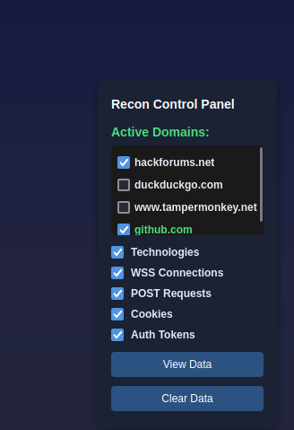
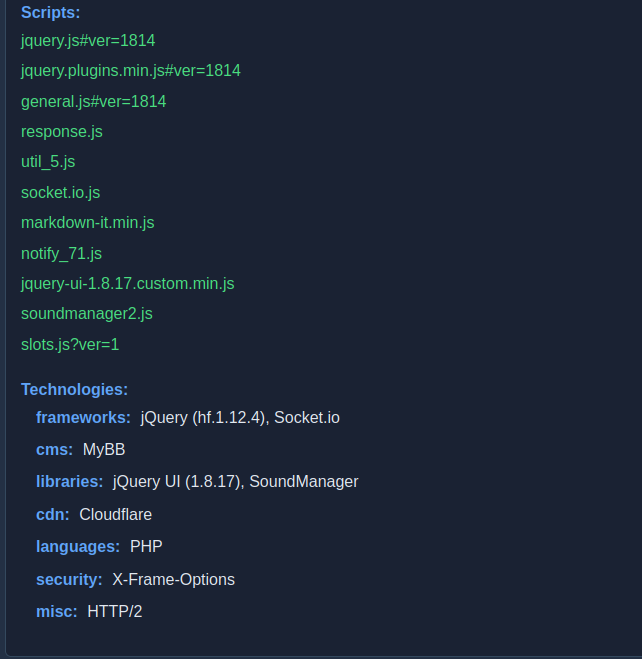
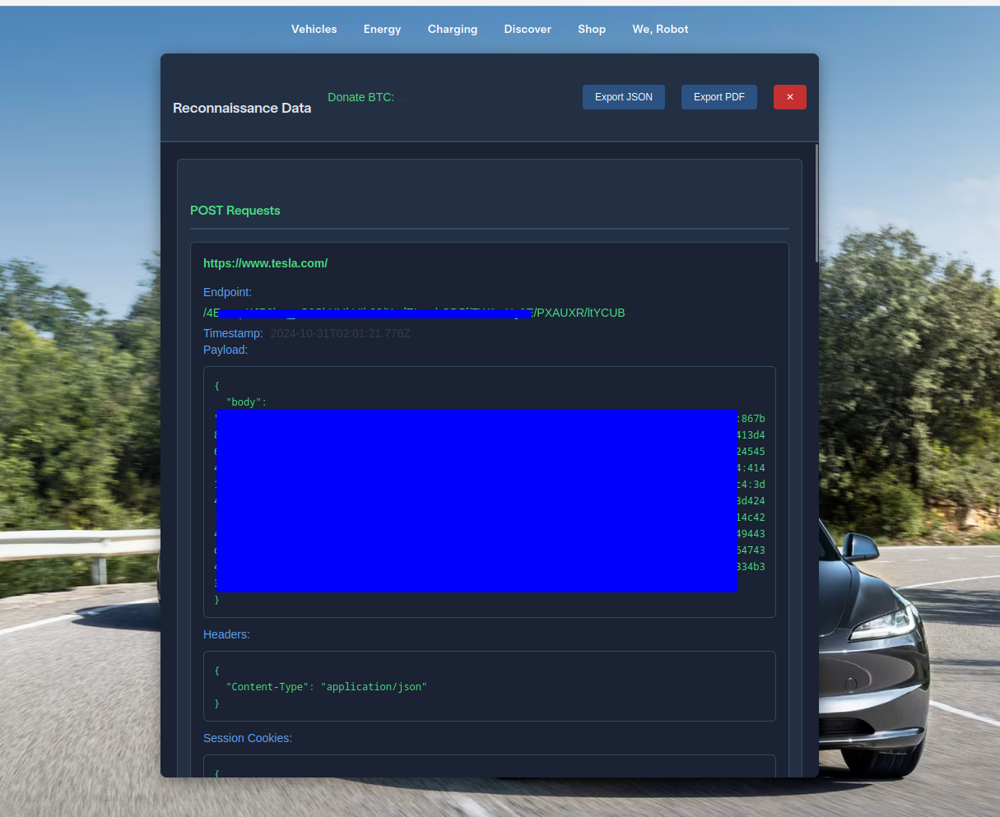

# Auto Passive Recon (Beta)
A browser-based reconnaissance tool that passively collects and analyzes web technologies and traffic.

## Key Features:
- Wappalyzer-style technology detection
- POST request monitoring and logging
- Domain-specific tracking with enable/disable options
- WebSocket connection detection
- Cookie and session monitoring
- Export capabilities (JSON/PDF)

---

## Current Beta Features:

### 1. Technology Detection:
   - **Frameworks:** Detects React, Angular, Vue.js, etc.
   - **Libraries:** Identifies jQuery, Chart.js, etc.
   - **CMS Systems:** Supports WordPress, Drupal, MyBB
   - **Security Features:** Monitors HSTS, CSP, etc.
   - **CDNs and Languages** used on the site

### 2. Traffic Monitoring:
   - **POST request capture** and logging
   - **Headers and cookies** logging
   - **Form submission tracking**
   - **Session data collection** for enhanced insights

### 3. User Interface:
   - **Control panel** with feature toggles
   - **Domain management system** for easy tracking
   - **Data viewer** with dark theme for readability
   - **Export functionality** for JSON and PDF outputs

---

## Screenshots

- **Control Panel Overview**
  

- **Technology Detection Example**
  

- **POST Request Logging**
  

- **Export Options**
  

---

## Note:
This tool is currently in beta. Some features may need refinement:
- **PDF export functionality** enhancements
- **Technology detection patterns** updates
- **WebSocket monitoring** optimizations

Contributions welcome for improving detection patterns and adding new features.
